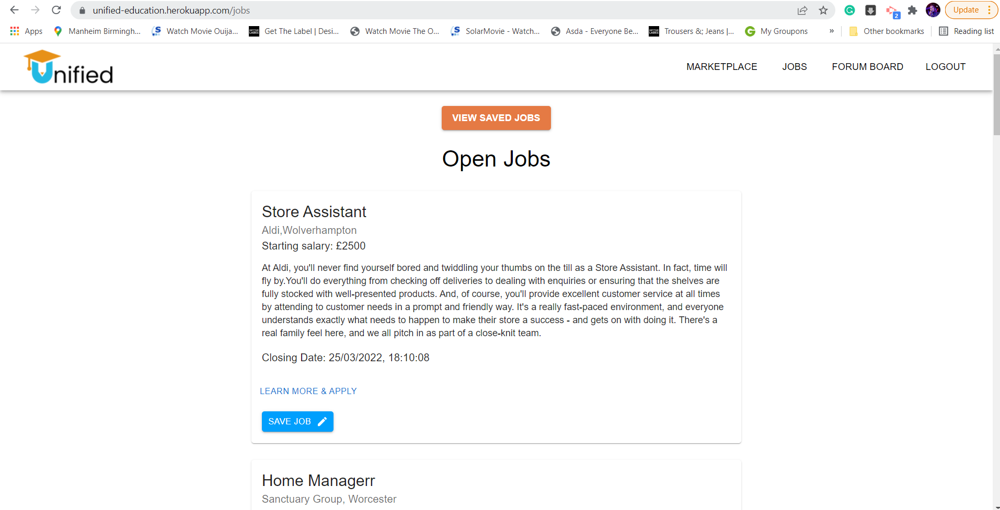
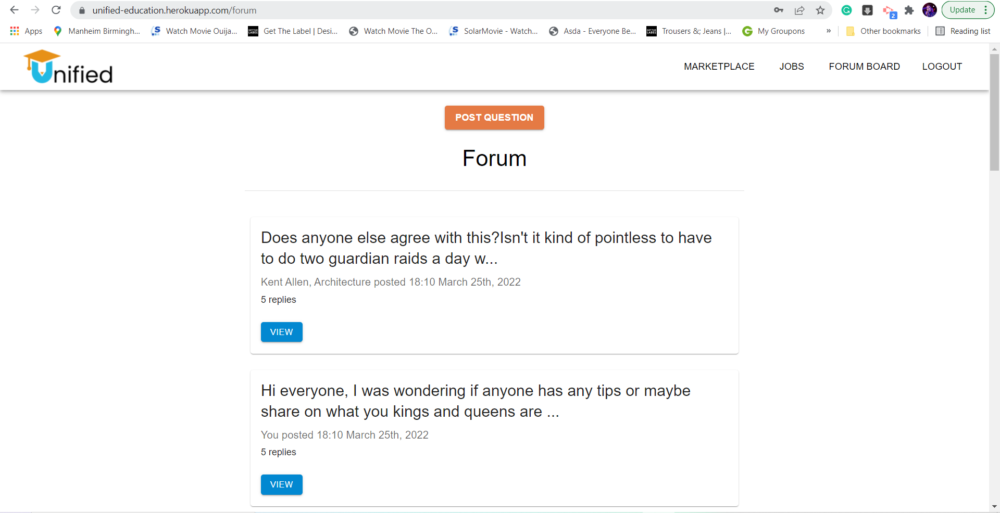
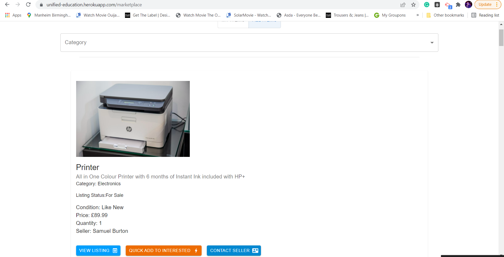

# UNIFIED

## Table Of Contents
  - [Project Links](#project-links)
  - [Description](#description)
  - [Technologies Used](#technologies-used)
  - [Contributors](#contributors)
  - [Screenshots](#screenshots)
 
## Project Links

Click [here](https://github.com/conorjkelly96/unified-server) to view the project on Github pages.
_Sever Repo_

Click [here](https://github.com/conorjkelly96/unified-client) to view the project on Github pages. _Client Repo_

Click [here](https://unified-education.herokuapp.com/) to view the deployed application

Click [here](https://desolate-eyrie-52631.herokuapp.com/) to view the deployed server

## Description

Unified is the One-stop-shop where students can find career development opportunities, engage with each other, and make environmentally and financially sustainable choices.

## Technologies Used

 Front End

- React
- Material UI
- Apollo Client
- AWS

Back End

- JavaScript
- GraphQL
- Apollo Server
- Mongoose & MongoDB
- JSONWebToken

## Contributors

- [Sumaia Sorna](https://github.com/SumaiaSorna)
- [Kayle Rieger Patton](https://github.com/kayleriegerpatton)
- [Conor Kelly](https://github.com/conorjkelly96)
- [Liana Laurentiu](https://github.com/lianavaleria15)
- [Matt Palmer](https://github.com/tigerbath)
- [Yashemabeth Mcleod](https://github.com/Yashemabeth)

# Screenshots

Logo

Deployed app screenshots

